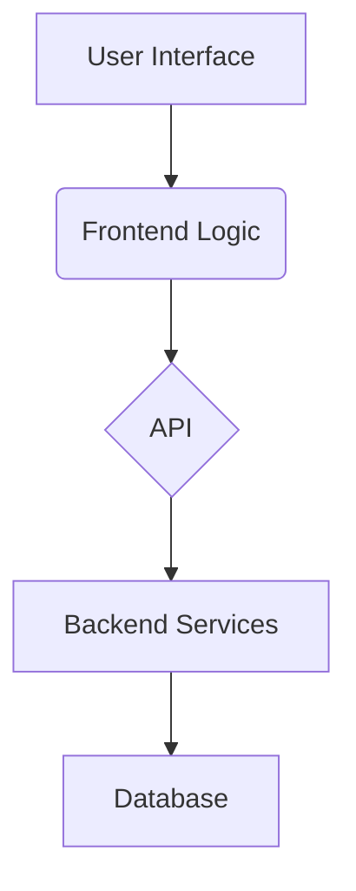

# System Patterns: Newstogram4

## System Architecture

The system consists of a web-based user interface (canvas editor), frontend logic for element manipulation and template management, an API for scraping news URLs, backend services for processing and data extraction, and (optionally) a database for storing templates or user data.

- Component 1: Canvas Editor (frontend) for editing and composing posts.
- Component 2: Template System for fast post creation.
- Component 3: News Scraper API (backend) to extract title and image from news URLs.

## Key Technical Decisions

- Decision 1: Use modular JavaScript for frontend logic to maximize flexibility and maintainability.
  - Rationale: Enables easy extension and separation of concerns.
- Decision 2: Implement a template system for post layouts.
  - Rationale: Allows users to quickly create visually appealing posts.
- Decision 3: Backend API for news scraping.
  - Rationale: Keeps scraping logic secure and separate from the frontend.

## Design Patterns in Use

- Pattern 1: MVC (Model-View-Controller) for frontend organization.
  - Location/Usage: JavaScript modules for model (data), view (canvas rendering), and controller (user actions).
- Pattern 2: Observer pattern for element state changes.
  - Location/Usage: Canvas editor updates UI in response to element changes.

## Component Relationships

- Interaction 1: User enters a news URL; frontend calls backend API to fetch title and image.
- Interaction 2: User edits elements on the canvas; changes are reflected in real time.
- Interaction 3: User selects a template; template system updates the canvas layout.

## Critical Implementation Paths

- Path 1: News URL scraping pipeline (URL input → API call → extract title/image → return to frontend).
- Path 2: Canvas editing workflow (element selection → move/resize/rotate → update state/UI).
- Path 3: Template rendering (user selects template → apply layout/styles → update canvas).

*(This file documents the 'how' of the system's technical implementation. It should align with the product goals in productContext.md and the core requirements in projectbrief.md.)*
